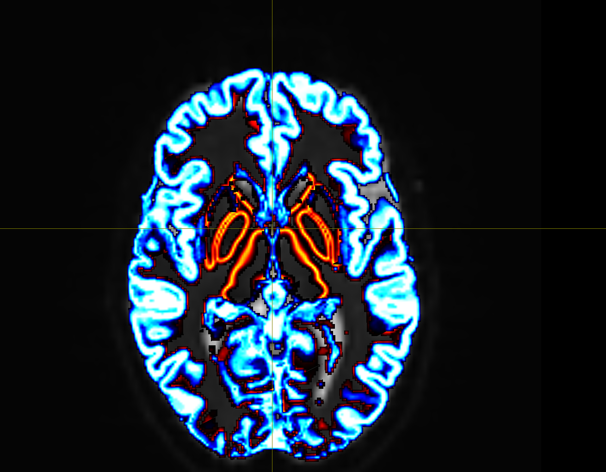
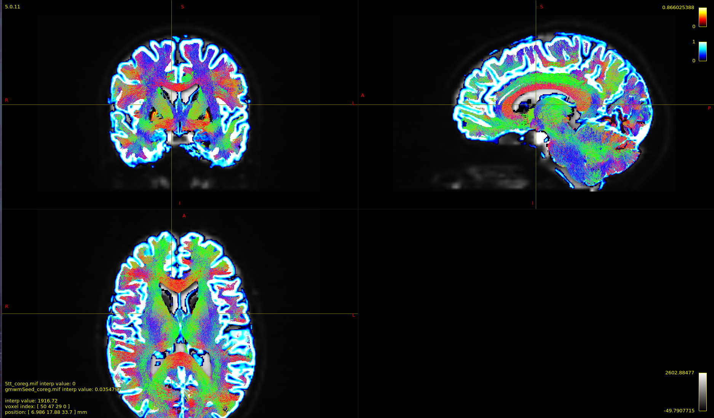
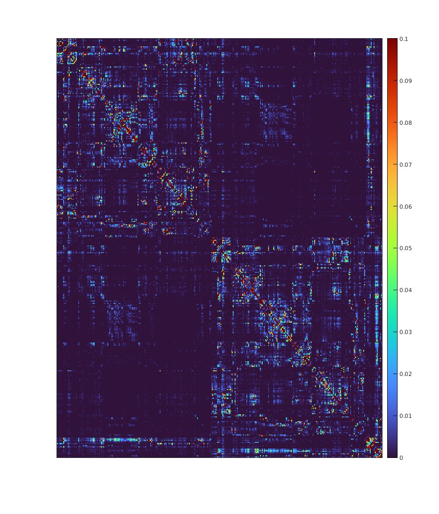
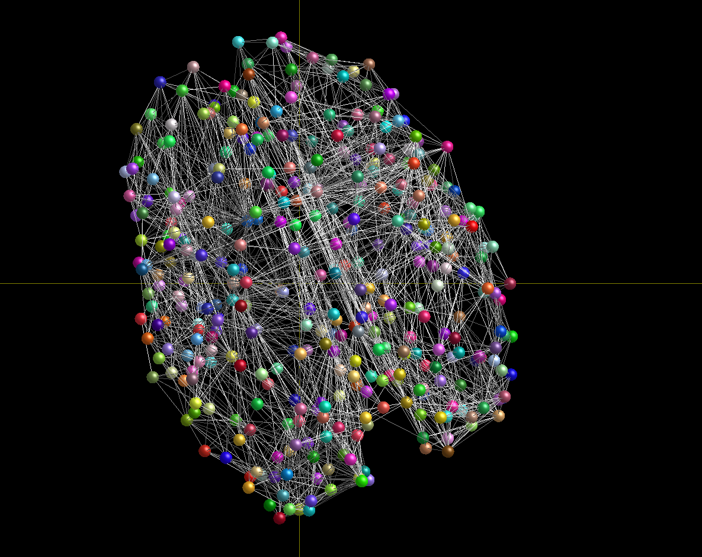

# B.A.T.M.A.N Tutorial
This repo is the result of following the guide located below

[B.A.T.M.A.N.: Basic and Advanced Tractography with MRtrix for All Neurophiles](https://osf.io/fkyht/#!)

You can use the below guide to get through the process of installing dependencies for the tutorial. Everything else is just code copied from the turtorial with the exception of the matlab code to visualize the matrix.

## Goal
Use the tools specified in the tutorial to create a human Connectome from MR-data (DWI images and T1-high-resolution images)

## Mrtrix and dependencies install guides
1. MRtricx https://www.mrtrix.org/download/
    1. install anaconda
    2. install mrtrix
2. FSL https://fsl.fmrib.ox.ac.uk/fsl/fslwiki/FslInstallation
    1. download and run the python install script
    2. if `flirt` gives you command not found then add your install to your path manually by adding the following to your .bashrc
    ```bash
    # Change the value for FSLDIR if you have 
    # installed FSL into a different location
    FSLDIR=/usr/local/fsl
    . ${FSLDIR}/etc/fslconf/fsl.sh
    PATH=${FSLDIR}/bin:${PATH}
    export FSLDIR PATH
    ```
3. Freesurfer https://surfer.nmr.mgh.harvard.edu/fswiki/DownloadAndInstall
    1. download the deb package and install with apt `sudo apt install freesurfer_7.2.0_amd64.deb`
4. Advanced Normalization Tools (ANTS) 
    1. Install instructions [here](https://github.com/ANTsX/ANTs/wiki/Compiling-ANTs-on-Linux-and-Mac-OS)
    2. Install script [here](https://github.com/cookpa/antsInstallExample/blob/master/installANTs.sh). Can also use the copy in this repo

## Seed Filters
The blue and red layers can delineate where tracks should start (red) and end (blue). This allows us to eliminate false positives when doing probablistic tractography


After generating tracks you can see end and begin where we specified


## Connectome
Connectome displayed using matlab. Code in mrtrix.m



## Brain Graph
Brain represented as a graph graphically with MRtrix connectome visualizer
